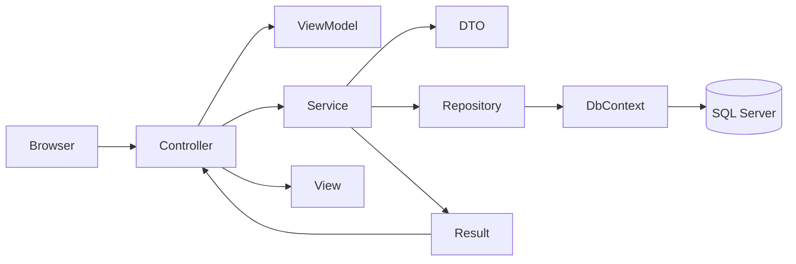

# GymApp

A gym management web application built with **ASP.NET Core MVC** on **.NET 9**, organized as a **3-tier (N-layer) architecture**. The app manages members, trainers, membership plans, workout sessions, bookings, and health records for a fitness center.

---

## Solution Structure

The solution is split into four projects, each with a single responsibility:

| Project | Role |
|---------|------|
| **GymApp.Presentation** | MVC web layer — controllers, Razor views, and view models |
| **GymApp.BusinessLogic** | Application/business layer — services, validation, and DTO mapping |
| **GymApp.DataAccess** | Data layer — EF Core, entities, repositories, migrations, and seeders |
| **GymApp.Shared** | Cross-cutting shared types — result pattern and enums |

```
GymApp.Presentation
        │
        ▼
GymApp.BusinessLogic ──► GymApp.Shared
        │
        ▼
GymApp.DataAccess ──────► GymApp.Shared
```

### Request flow



1. The **controller** receives HTTP requests and binds **view models**.
2. It calls a **service** in the business layer.
3. The service uses **repositories** to read/write data and returns a **`Result<T>`**.
4. The controller maps DTOs to view models and renders Razor **views**.

---

## Domain Model

### Entities

| Entity | Description |
|--------|-------------|
| **Member** | Gym member with personal info, address, join date, and optional photo |
| **Trainer** | Staff member who leads sessions; has a fitness specialty |
| **HealthRecord** | One-to-one with a member — height, weight, blood type, notes |
| **Plan** | Membership plan (name, price, duration, active flag) |
| **Membership** | Links a member to a plan with start/end dates |
| **Category** | Session type (Yoga, Cardio, Weightlifting, etc.) |
| **Session** | Scheduled class led by a trainer in a category |
| **Booking** | Member reservation for a session, with attendance tracking |

### Entity hierarchy

- **`BaseEntity`** — shared audit and soft-delete columns (`Id`, `CreatedAt`, `UpdatedAt`, `DeletedAt`, `IsDeleted`)
- **`UserBaseEntity`** — base for user-like entities (`Member`, `Trainer`)

### Relationships

```
Member ──1:1── HealthRecord
Member ──1:M── Booking
Member ──1:M── Membership ──M:1── Plan
Trainer ──1:M── Session ──M:1── Category
Session ──1:M── Booking
```

### Owned types

- **`AddressDetails`** — embedded value object on `Member` and `Trainer` (`BuildingNo`, `Street`, `City`)

---

## Design Patterns & Features

### 1. 3-Tier / N-Layer Architecture

Presentation, business logic, and data access are separated into distinct projects. The presentation layer never talks to EF Core or the database directly — it only depends on services.

### 2. Repository Pattern

Data access is abstracted behind repository interfaces.

- **`IRepository<TEntity>`** — generic repository with common CRUD operations:
  - `GetAllAsync` (with optional eager-loading via `includes`)
  - `GetByIdAsync` / `GetByIdIncludingDeletedAsync`
  - `FindAsync`, `ExistAsync`
  - `Add`, `Update`, `SoftDelete`, `SaveChangesAsync`
- **Specific repositories** extend the generic interface for each entity:
  - `IMemberRepository` / `MemberRepository`
  - `IPlanRepository` / `PlanRepository`

Read queries use **`AsNoTracking()`** for better performance. Include paths are validated via reflection before being applied.

The generic repository is registered in DI:

```csharp
builder.Services.AddScoped(typeof(IRepository<>), typeof(Repository<>));
```

### 3. Result Pattern

Business operations return **`Result<T>`** instead of throwing exceptions for expected failures. Defined in `GymApp.Shared/ResultPattern/Result.cs`:

| Property | Purpose |
|----------|---------|
| `IsSuccess` | Whether the operation succeeded |
| `Value` | The returned data on success |
| `ErrMsg` | Human-readable error message on failure |
| `ErrKey` | Optional key (e.g. property name) for model-state binding |

Factory methods:

- `Result<T>.Success(value)`
- `Result<T>.Failure(errMsg, errKey?)`

**Example usage** — duplicate email validation in `MemberService`:

```csharp
if (await _memberRepo.ExistAsync(m => m.Email == email, cancellationToken))
    return Result<bool>.Failure("Email exists", nameof(MemberDto.Email));
```

Controllers check `result.IsSuccess` and either render the view with errors or proceed.

### 4. DTO Pattern

The business layer exposes **Data Transfer Objects** instead of EF entities to upper layers:

- `MemberDto`, `PlanDto`, `AddressDetailsDto`, `HealthRecordsDto`

Services map entities ↔ DTOs, keeping the presentation layer decoupled from the database schema.

### 5. ViewModel Pattern

The presentation layer uses **view models** tailored for Razor views and form binding:

- `MemberCreateViewModel`, `MemberIndexViewModel`
- `PlanViewModel`, `PlanIndexViewModel`

Controllers map between view models and DTOs at the boundary.

### 6. Service Layer

Business rules and orchestration live in scoped services:

| Service | Responsibilities |
|---------|-----------------|
| `IMemberService` / `MemberService` | List members, create member with health record, validate uniqueness |
| `IPlanService` / `PlanService` | List plans, get plan by id |

Services are registered via `AddBusinessLogic()` extension method.

### 7. Dependency Injection

Each layer registers its services through extension methods:

- **`AddDataAccess(connectionString)`** — DbContext, interceptors, repositories
- **`AddBusinessLogic()`** — application services

Constructor injection (primary constructors) is used throughout controllers, services, and repositories.

**Keyed services** — `IPlanRepository` is also registered as a keyed service (`"plan"`) in `Program.cs`, demonstrating ASP.NET Core keyed DI.

### 8. Entity Framework Core

- **Provider:** SQL Server
- **Code-first** approach with Fluent API configurations (`IEntityTypeConfiguration<T>`)
- Configurations are auto-discovered via `ApplyConfigurationsFromAssembly`
- **Migrations** applied automatically in Development on startup

#### Fluent API highlights

- **Global soft-delete filter** — all `BaseEntity` types exclude `IsDeleted == true` rows by default
- **Common user config** — shared rules for `Member` and `Trainer` (max lengths, unique email/phone indexes, enum-to-string conversion)
- **Check constraints** — e.g. session capacity (1–25), plan duration (1–365 days), valid date ranges
- **Precision** — plan price stored as `decimal(10,2)`
- **Owned entities** — address columns mapped into the parent table

### 9. Soft Delete

Two mechanisms work together:

1. **`SoftDeleteInterceptor`** — intercepts EF `SaveChanges`; when an entity implementing `ISoftDeletable` is marked `Deleted`, it converts the operation to an update (`IsDeleted = true`, `DeletedAt = UtcNow`)
2. **Global query filter** — automatically filters out soft-deleted records (`IsDeleted == false`) on all `BaseEntity` queries
3. **Repository `SoftDelete()`** — explicit soft-delete via setting `IsDeleted = true`

`GetByIdIncludingDeletedAsync` uses `IgnoreQueryFilters()` to retrieve deleted records when needed.

### 10. Database Seeding

Seed data is organized per entity in `GymApp.DataAccess/Data/Seeder/`:

| Seeder | Seeds |
|--------|-------|
| `PlanSeeder` | Membership plans (Basic, Standard, Premium, etc.) |
| `CategorySeeder` | Workout categories |
| `TrainerSeeder` | Sample trainers |
| `MemberSeeder` | Sample members |
| `SessionSeeder` | Scheduled sessions |
| `HealthRecordSeeder` | Health records for members |
| `MembershipSeeder` | Member–plan subscriptions |
| `BookingSeeder` | Session bookings |

`DatabaseSeeder.SeedAllDataAsync()` runs all seeders in dependency order. Each seeder skips if its table already has data. Seeding runs in **Development** after migrations.

### 11. Audit Columns

Every entity inherits audit fields from `BaseEntity`:

- `CreatedAt`, `UpdatedAt`, `DeletedAt`

These support tracking when records were created, modified, or soft-deleted.

### 12. Shared Enums

Domain enums live in `GymApp.Shared/Enums/` so both business and presentation layers can reference them without depending on the data layer:

- `GenderEnum`, `BloodTypeEnum`, `FitnessSpecialty`

Stored as strings in the database via EF value conversions.

### 13. CancellationToken Support

Async service and repository methods accept `CancellationToken` for cooperative cancellation, propagated from controller actions.

### 14. MVC & Razor Views

- Standard MVC routing: `{controller=Home}/{action=Index}/{id?}`
- Layout partials: `_Header`, `_Footer`, `_Layout`
- Client-side validation via `_ValidationScripts`
- Anti-forgery tokens on POST actions

### 15. Controllers

| Controller | Actions |
|------------|---------|
| `HomeController` | Landing page |
| `PlansController` | List plans, view plan details |
| `MembersController` | List members, create member (with health record) |

---

## Technology Stack

| Technology | Version / Notes |
|------------|----------------|
| .NET | 9.0 |
| ASP.NET Core MVC | Razor views |
| Entity Framework Core | 9.0.16 |
| SQL Server | LocalDB / SQL Express |
| Bootstrap | Frontend styling (wwwroot) |

---

## Getting Started

### Prerequisites

- [.NET 9 SDK](https://dotnet.microsoft.com/download)
- SQL Server (LocalDB or full instance)

### Configuration

Update the connection string in `GymApp.Presentation/appsettings.json`:

```json
"ConnectionStrings": {
  "DefaultConnection": "Server=.;Database=GymDb;Trusted_Connection=True;TrustServerCertificate=true"
}
```

### Run

```bash
dotnet run --project GymApp.Presentation
```

On first run in **Development**:

1. EF Core applies pending migrations
2. `DatabaseSeeder` populates sample data

### EF Core migrations

```bash
# Add a new migration
dotnet ef migrations add <MigrationName> --project GymApp.DataAccess --startup-project GymApp.Presentation

# Update database manually (optional — auto-migrates in Development)
dotnet ef database update --project GymApp.DataAccess --startup-project GymApp.Presentation
```

---

## Project Folder Overview

```
GymApp/
├── GymApp.Presentation/
│   ├── Controllers/          # MVC controllers
│   ├── Views/                # Razor views
│   ├── ViewModels/           # Presentation-layer models
│   └── Program.cs            # App entry point & DI setup
│
├── GymApp.BusinessLogic/
│   ├── Services/             # Business services & interfaces
│   │   └── DTOs/             # Data transfer objects
│   └── ServiceCollectionExtensions.cs
│
├── GymApp.DataAccess/
│   ├── Data/
│   │   ├── Contexts/         # GymDbContext
│   │   ├── Configurations/   # Fluent API entity configs
│   │   └── Seeder/           # Database seeders
│   ├── Entities/             # Domain entities & owned types
│   ├── Repository/           # Generic & specific repositories
│   ├── Interceptors/         # SoftDeleteInterceptor
│   ├── Migrations/           # EF Core migrations
│   └── ServiceCollectionExtensions.cs
│
├── GymApp.Shared/
│   ├── ResultPattern/        # Result<T> wrapper
│   └── Enums/                # Shared enumerations
│
└── GymApp.sln
```

---

## Summary

GymApp demonstrates a clean **separation of concerns** across presentation, business, and data layers. Key architectural choices include the **generic repository pattern**, **result pattern** for error handling, **DTO/view model mapping**, **EF Core soft delete** with global filters, **Fluent API configurations**, and **structured database seeding** — all wired together through **dependency injection** extension methods.
